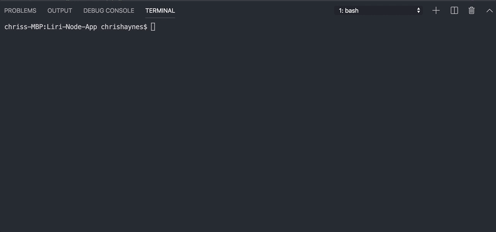
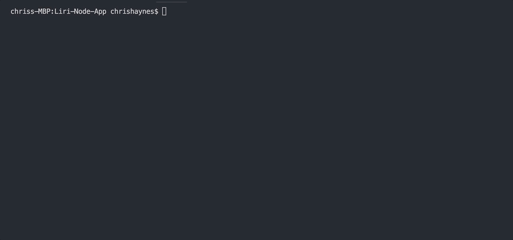

# Liri Node App

LIRI is a Language Interpretation and Recognition Interface. This command line node app takes in parameters and gives you back data. 

# Get Started

**To use this app the user needs to run: npm install**   
  * They should do this from their terminal, and make sure they are inside the     corresponding directory.
  * This will give them access to the node modules required to run the app.
  * Create a .env file 
  * In that file provide their Spotify API keys
  * SPOTIFY_ID=your-spotify-id
  * SPOTIFY_SECRET=your-spotify-secret
    
**The user has four categories they can search:** 
   *  They can search the Bands In Town API to find out a favorite artist's next concert.
   *  They can search the Spotify API to get information on a favorite song.
  *  They can search the OMDB API to find information on a favorite movie.
  *  They can pull from the random.txt file to run a Spotify song search of
       the text from that file.

**Instructions for searching:**
   * Type in one of the following four lines into your command line.
  * node liri.js spotify-this-song <song name here>
  * node liri.js movie-this <movie name here>
  * node liri.js do-what-it-says
  * node liri.js concert-this <artist/band name here>
    **These commands make API calls to retrieve the associated data that is displayed in the terminal**

# Demo Gifs

Here's what happens if the user doesn't enter a recognizable command

Now see what happens when they search for a song

Search for a movie

Do what it says 

# Technologies Used

* Node.js
* Axios
* Moment
* Spotify API
* OMDB API
* Bands in Town API

# Issues

Currently their is not fuctionality for the concert-this command
